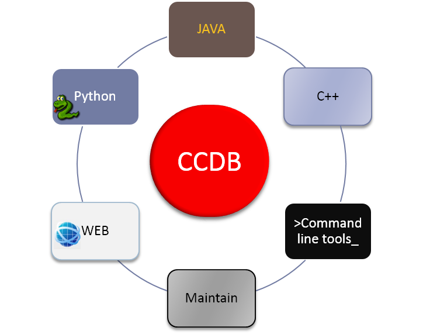
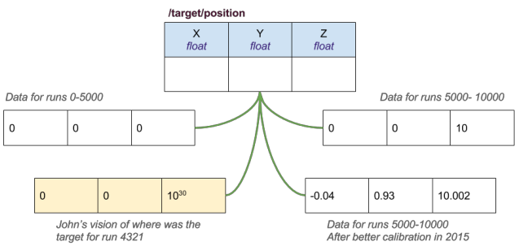

## CCDB

The **Calibration Constants Database (CCDB)** serves the various sets of calibration constants
necessary to reconstruct data from a particle physics detector with multiple quasi-independent
sub-detectors. Each sub-detector has its own needs for the form and function of constants. These
constants change as a function of run number, the run-number boundaries between changes differ for
different sub-detectors, and the definition of "the best constants" for a given run is itself a
function of time. CCDB keeps track of all of this.



The CCDB package comes with:

- `ccdb` command line interface to manage and introspect constants
- Web interface (local GUI)
- Python API
- C++ API
- Java API
- Tools and utilities to manage an infrastructure

## A simple example

Take a simple example of calibration data, say "target position," which is defined by three
coordinates x, y, z, each represented by a floating point number.

Using C++ as an example language, if a user asks for "target position":

```cpp
auto data = calibration->GetCalib("/target/position");
```

the calibration database provides the appropriate data in the current context so it can be used
like:

```cpp
if (data["z"] > 30) ...
```

"The **current context**" is the key phrase here, since the values of target position could be
different for different runs, values may be updated with time (e.g. if more precise calibration is
performed), and a user may want to use a personal version of constants.



The picture above illustrates features of CCDB that involve control of the context:

- The data can be addressed by filesystem-like paths (`target/position`)
- The returned data depends on a run number.
- A history mechanism: by default CCDB honors the last assignment of data to a particular run, but
  one can always recover values stored in the past.
- Variations (equivalent to "branches" in version control systems): users have the ability to
  create and work with alternative versions of the data, varying the run assignments and/or the data
  itself.

## Quick start

The `ccdb` command and the Python API are distributed on [PyPI](https://pypi.org/project/ccdb/):

```bash
python -m pip install --upgrade ccdb
```

After installation you have:

- the `ccdb` Python library,
- the `ccdb` command, to work with CCDB in the terminal (also runnable as `python -m ccdb`).

Try it against the HallD read-only database, for example:

```bash
export CCDB_CONNECTION="mysql://ccdb_user@hallddb.jlab.org/ccdb"
ccdb -i              # start the interactive shell
```

Continue with:

- [Installation](get-started/installation.md) — all installation options (pip/uv, source, C++, MySQL)
- [Command line interface](cli.md) — the `ccdb` tool
- [Concepts illustrated](concepts/concepts.md) — namepaths, table types, assignments, requests
